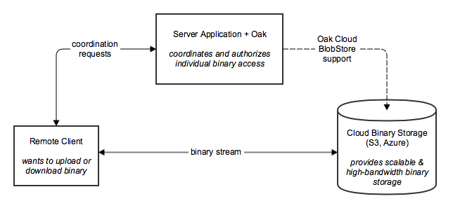
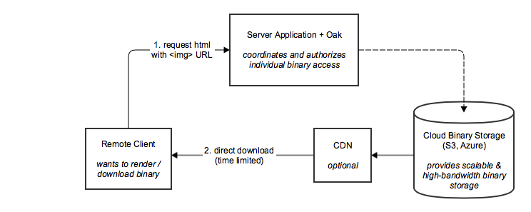
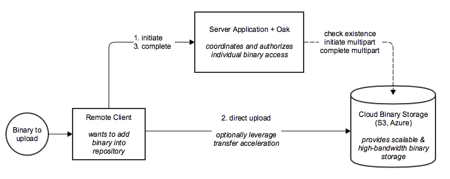

<!--
   Licensed to the Apache Software Foundation (ASF) under one or more
   contributor license agreements.  See the NOTICE file distributed with
   this work for additional information regarding copyright ownership.
   The ASF licenses this file to You under the Apache License, Version 2.0
   (the "License"); you may not use this file except in compliance with
   the License.  You may obtain a copy of the License at

       http://www.apache.org/licenses/LICENSE-2.0

   Unless required by applicable law or agreed to in writing, software
   distributed under the License is distributed on an "AS IS" BASIS,
   WITHOUT WARRANTIES OR CONDITIONS OF ANY KIND, either express or implied.
   See the License for the specific language governing permissions and
   limitations under the License.
  -->

# Direct Binary Access

`@since Oak 1.10`

This feature enables a remote client of an Oak-based application to upload or download binaries directly to/from a supported Oak [BlobStore](../plugins/blobstore.html), without streaming the binaries through the application and Oak itself.  To use the feature, the underlying storage provider must support this capability and the corresponding Oak BlobStore must implement feature support.  Currently, the feature is implemented in [S3DataStore](https://jackrabbit.apache.org/oak/docs/apidocs/org/apache/jackrabbit/oak/blob/cloud/s3/S3DataStore.html) (over [Amazon S3](https://aws.amazon.com/s3/)) and [AzureDataStore](https://jackrabbit.apache.org/oak/docs/apidocs/org/apache/jackrabbit/oak/blob/cloud/azure/blobstorage/AzureDataStore.html) (over [Microsoft Azure Blob Storage](https://azure.microsoft.com/en-us/services/storage/blobs/)). Authentication and access control is fully enforced by Oak, as the direct access is resource- and time-limited.

Using this feature frees an Oak-based web application from the network, memory and disk I/O involved in transferring binary files, and provides clients of the application with scalable, redundant and high-bandwidth access directly to the cloud storage. This eliminates the web application server and its deployment environment as a potential bottleneck of network capacity. Furthermore, it allows leveraging CDN or transfer acceleration options of the cloud storage providers.

The API is designed to be independent of the particular cloud provider, and relies on standard HTTP binary upload & download, as well as cryptographically signed URLs.

## Architecture

The following diagram shows the 3 involved parties:  A _remote client_, the Oak-based _server application_ and the _cloud binary storage_. Rather than pushing binaries from the client through the server application and Oak into the cloud binary storage and having the application handle the substantial extra I/O load, we let the client directly stream the binaries in the cloud storage.



Further background of the design of this feature can be found [on the wiki](https://jackrabbit.apache.org/archive/wiki/JCR/Direct-Binary-Access_115513390.html).

## Requirements

To use this feature, Oak must be configured with a [BlobStore](../plugins/blobstore.html) that supports this feature.

Currently these Blob/DataStores are supported:

* [S3DataStore](../osgi_config.html#Jackrabbit_2_-_S3DataStore)
* AzureDataStore

## Configuration

The feature has to be explicitly enabled by setting properties on the DataStore. In the table, "S3" refers to `S3DataStore`, "Azure" to `AzureDataStore`.

| Property | Type | Default | Description |
|----------|------|---------|-------------|
| `presignedHttpUploadURIExpirySeconds`   | Integer  | 0 (disabled)     | Time limit for upload URLs, in seconds. Choose a value long enough for clients to upload larger binaries and possibly retry, but not unlimited to ensure access control. Setting to 0 disables the direct upload feature. |
| `presignedHttpDownloadURIExpirySeconds` | Integer  | 0 (disabled)     | Time limit for download URLs, in seconds. Choose a value long enough for clients to download larger binaries and possibly retry, but not unlimited to ensure access control. Setting to 0 disables the direct download feature. |
| `presignedHttpDownloadURICacheMaxSize`  | Integer  | 0 (disabled)     | **Experimental.** Cache size for reusing download URLs. Expired URLs will be cached for half their expiry time, hence if this feature is enabled, clients might get URLs that expire after half of `presignedHttpDownloadURIExpirySeconds`. Setting to 0 disables the cache. |
| `presignedHttpDownloadURIVerifyExists` | Boolean | true | Flag to determine whether to check that a binary exists in blob storage before issuing a presigned download URI.  The default is to verify existence first, providing assurance that the signed URI references an existing binary.  If this flag is set to false, the existence check is skipped.  This makes generating the signed URI anywhere from 100 to 1000 times faster since no network API calls are made, but means it is possible in some cases to return a signed URI that doesn't reference an existing blob.  See [OAK-7998](https://issues.apache.org/jira/browse/OAK-7998) and [OAK-8552](https://issues.apache.org/jira/browse/OAK-8552) for more details. |
| S3:&nbsp;`presignedURIEnableTransferAcceleration` <br/>Azure:&nbsp;n/a                                     | Boolean  | false (disabled) | **Experimental.** Enables [S3 Transfer Acceleration](https://docs.aws.amazon.com/AmazonS3/latest/dev/transfer-acceleration.html) for both upload and download URLs. Transfer acceleration must be enabled on the S3 bucket before Oak starts. |

## API Javadoc

The APIs for this feature are available in [jackrabbit-api](https://jackrabbit.apache.org/jcr/jcr-api.html):

* [JackrabbitValueFactory](http://jackrabbit.apache.org/api/trunk/org/apache/jackrabbit/api/JackrabbitValueFactory.html) for uploading - cast `session.getValueFactory()` to this and use `initiateBinaryUpload()` and `completeBinaryUpload()`
* [BinaryDownload](http://jackrabbit.apache.org/api/trunk/org/apache/jackrabbit/api/binary/BinaryDownload.html) for downloading - cast a `Binary` to this and call `getURI()`
* other elements are in the [org.apache.jackrabbit.api.binary package](http://jackrabbit.apache.org/api/trunk/org/apache/jackrabbit/api/binary/package-summary.html)

## Usage

### Download



This example shows how to retrieve a time-limited presigned URL for reading a binary:

```
Node ntFile = session.getNode("/content/file.png");
Node ntResource = ntFile.getNode("jcr:content");

Binary binary = ntResource.getProperty("jcr:data").getBinary();

if (binary instanceof BinaryDownload) {
    BinaryDownload binaryDownload = (BinaryDownload) binary;

    BinaryDownloadOptions.BinaryDownloadOptionsBuilder builder = BinaryDownloadOptions.builder()
        // would typically come from a JCR node name
        .withFileName(ntFile.getName())
        // mime type must typically be set and would be stored along with the nt:file
        .withMediaType(ntResource.getProperty("jcr:mimeType"));

    if (ntResource.hasProperty("jcr:encoding")) {
        builder.withCharacterEncoding(ntResource.getProperty("jcr:encoding"));
    }

    // if you need to prevent the browser from potentially executing the response
    // (for example js, flash, html), you can enforce a download with this option
    // builder.withDispositionTypeAttachment();

    URI uri = binaryDownload.getURI(builder.build());

    if (uri == null) {
        // feature not available
        // ...
    }

    // use uri in  or send in response to remote client
    // ...
}
```

Please note that only `Binary` objects returned from `Property.getBinary()`, `Property.getValue().getBinary()` or `Property.getValues() ... getBinary()` will support a functional `BinaryDownload`.

Also note that clients should always check whether the URI returned from the `getURI()` call is null.  A null return value generally indicates that the feature is not available.  But this situation is also possible in two other cases:

* If the binary is stored in-line in the node store.  If the binary is smaller than the minimum upload size, it will be stored in the node store instead of in cloud blob storage, and thus a direct download URI cannot be provided.
* If the data store implementation is using asynchronous uploads and the binary is still in cache.  If a client adds a binary via the repository (i.e. not using the direct binary upload feature) and then immediately requests a download URI for it, it is possible that the binary is still in cache and not yet uploaded to cloud storage, and thus a direct download URI cannot be provided.

### Upload

The direct binary upload process is split into 3 phases:

1. **Initialize:** A remote client makes request to the Jackrabbit-based application to request an upload, which calls `initiateBinaryUpload(long, int)` and returns the resulting information to the remote client.
2. **Upload:** The remote client performs the actual binary upload directly to the binary storage provider. The BinaryUpload returned from the previous call to `initiateBinaryUpload(long, int)` contains detailed instructions on how to complete the upload successfully. For more information, see the `BinaryUpload` documentation.
3. **Complete:** The remote client notifies the Jackrabbit-based application that step 2 is complete. The upload token returned in the first step (obtained by calling `BinaryUpload.getUploadToken()`) is passed by the client to `completeBinaryUpload(String)`. This will provide the application with a regular JCR Binary that can then be used to write JCR content including the binary (such as an `nt:file` structure) and persist it.



#### 1. Initiate

A remote client would make a request to an HTTP API and provide the file size of the file to upload and the JCR path to upload it to:

`POST /initiate-upload?filesize=1234&path=/content/file.png`

The code example below shows this servlet using the API and returning the upload instructions to the client.

```
/**
 * Servlet registered under /initiate-upload
 */
public class InitiateUploadServlet extends HttpServlet {

   public void doPost(HttpServletRequest request, HttpServletResponse response)
               throws IOException, ServletException {

        final Session session = // .. retrieve session for request

        // allows to limit number of returned URIs in case the response message size is limited
        // use -1 for unlimited
        final int maxURIs = 50;

        final String path = request.getParameter("path");
        final long filesize = Long.parseLong(request.getParameter("filesize"));

        ValueFactory vf = session.getValueFactory();
        if (vf instanceof JackrabbitValueFactory) {
            JackrabbitValueFactory valueFactory = (JackrabbitValueFactory) vf;

            BinaryUpload upload = valueFactory.initiateBinaryUpload(filesize, maxURIs);

            if (upload == null) {
                // feature not available, must pass binary via InputStream through vf.createBinary()
                // ...
            } else {
                JSONObject json = new JSONObject();
                json.put("minPartSize", upload.getMinPartSize());
                json.put("maxPartSize", upload.getMaxPartSize());

                JSONArray uris = new JSONArray();
                Iterator<URI> iter = upload.getUploadURIs();
                while (iter.hasNext()) {
                    uris.put(iter.next());
                }
                json.put("uploadURIs", uris);

                // provide the client with a complete URL to request later, pass through the path
                json.put("completeURL", "/complete-upload?uploadToken=" + upload.getUploadToken() + "&path=" + path);

                response.setContentType("application/json");
                response.setCharacterEncoding("UTF-8");
                response.getWriter().write(json.toString());
            }
        } else {
            // feature not available, must pass binary via InputStream through vf.createBinary()
            // ...
        }
    }
}
```

Clients should always check whether the `BinaryUpload` returned from `valueFactory.initiateBinaryUpload()` is null, and also should handle the case where no upload URIs are returned.  Either situation indicates that the feature is not supported.

#### 2. Upload

The remote client will upload using the instructions according to the [upload algorithm described in BinaryUpload](http://jackrabbit.apache.org/api/trunk/org/apache/jackrabbit/api/binary/BinaryUpload.html).

#### 3. Complete

After the upload has successfully completed, it will notify the application, in this case by making a request to the `completeURL` from the response:

`POST /complete-upload?uploadToken=abcdedfghijkl`

The code example below shows the servlet to handle the `complete-upload` request:

```
/**
 * Servlet registered under /complete-upload
 */
public class CompleteUploadServlet extends HttpServlet {

   public void doPost(HttpServletRequest request, HttpServletResponse response)
               throws IOException, ServletException {

        final Session session = // .. retrieve session for request

        final String path = request.getParameter("path");
        final String uploadToken = request.getParameter("uploadToken");

        ValueFactory vf = session.getValueFactory();
        if (vf instanceof JackrabbitValueFactory) {
            JackrabbitValueFactory valueFactory = (JackrabbitValueFactory) vf;

            Binary binary = valueFactory.completeBinaryUpload(uploadToken);

            Node ntFile = JcrUtils.getOrCreateByPath(path, "nt:file", session);
            Node ntResource = ntFile.addNode("jcr:content", "nt:resource");

            ntResource.setProperty("jcr:data", binary);

            // also set jcr:mimeType etc.

            session.save();

        } else {
            // feature not available - not unexpected if initiate-upload worked
        }
    }
}
```

# CDN Support

`@since Oak 1.18 (AzureDataStore)`

Oak can be configured to make use of CDNs if desired.  Configuring a CDN for use with Oak can provide clients with accelerated blob access times as blobs are accessed via more local caches instead of from the origin blob store.

## Preconditions

The following conditions must be true to leverage a CDN:
* You must be using `AzureDataStore`.  (`S3DataStore` will be supported at a future date but is not currently supported.)
* You must have Direct Binary Access enabled - CDNs only offer a benefit with direct access URIs.
* You must have a CDN configured that uses your cloud blob storage container as the origin.

## Configuration

| Property | Type | Default | Description |
|----------|------|---------|-------------|
| `presignedHttpDownloadURIDomainOverride`   | String  | null     | When this property is set, the domain provided will be used for direct download URIs instead of the default direct download domain. |
| `presignedHttpUploadURIDomainOverride` | String  | null     | When this property is set, the domain provided will be used for direct upload URIs instead of the default direct upload domain. |

## Uses

CDNs may be used for direct upload as well as direct download, if the CDN in question supports such behavior.  CDNs that support this behavior include AWS CloudFront, all Azure CDN offerings, and some other third-party CDNs do as well; however, these capabilities are the responsibility of the service providers, not Oak.  Check with your CDN provider for authoritative information on suitability; comprehensive testing is recommended.

Note that you are not required to configure both domains, nor is it required that both domains be the same.  For example, if one CDN offers the best download performance and another CDN offers the best upload performance, you may choose to implement both and set each configuration parameter to a different domain.  Likewise, you are not required to set them both.  If you only wish to use CDNs for download but not upload, simply configure the download parameter with the CDN domain and don't configure an upload domain.
